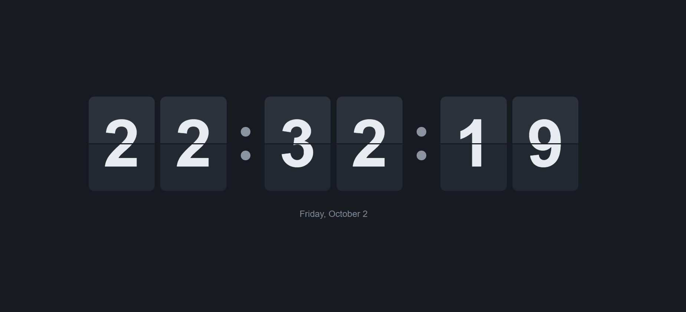

# FlipClock

a little flip clock i made for fun.

it's just a simple digital clock made with html, css and javascript.
no frameworks or anything.

## what it does

* shows the current time
* flip animation when a number changes
* shows the current date
* works on mobile too

## why i made it

i wanted to try making a proper flip clock instead of just putting a normal digital clock on a page.

the first version was pretty ugly lol, so i'm slowly making it look better.

## made with

* HTML
* CSS
* JavaScript

## run it

just download the repo and open `index.html`.

that's it.

## screenshot

---

made by Hani
 
